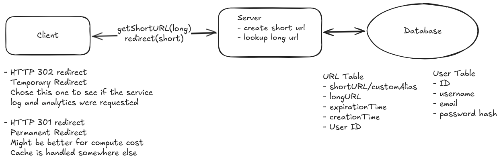

# Software Design Document

## Requirements

### Functional Requirements

- Create a short URL from a long URL
  - optionally support custom alias
  - optionally support an expiration time
- Be redirected to the original URL from the short URL

### Nonfunctional Requirements

- Low latency on redirects (~200 ms)
- Scale to support a million daily active users and 10 million URLs
- Ensure uniqueness of short code
- High availability, eventual consistency for URL shortening (CABS theory)

## Core Entities

- Original URL
- Short URL
- User

## API

shorten a url
POST /urls -> shortURL

redirection
GET /{shortURL} -> Redirect to Original URL

## High Level Design

